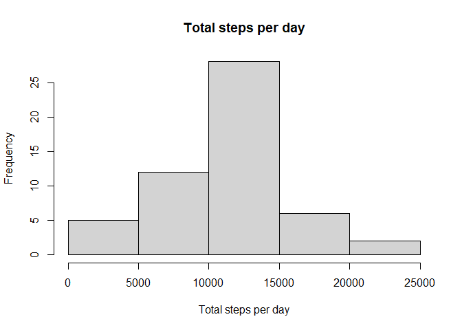
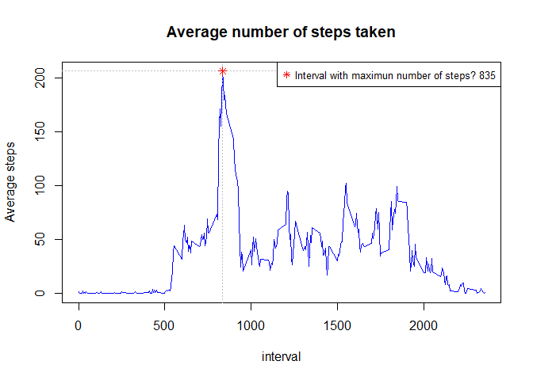
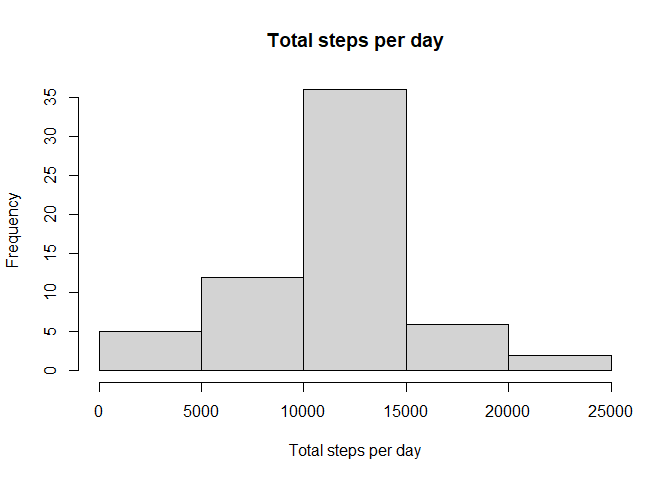
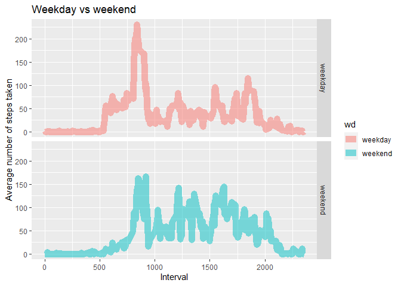

# Loading and preprocessing the data
# What is mean total number of steps taken per day?


```r
  act <- read.csv("activity.csv")
  d1 <-act %>%
    select(date, steps) %>%
    filter(!is.na(steps))  %>%
    group_by(date) %>%
    summarize(
      sum_steps = sum(steps),
      mean_steps = mean(steps)
      ) %>%
    arrange(date)
```

```
## `summarise()` ungrouping output (override with `.groups` argument)
```

```r
with(d1, hist(sum_steps, main="Total steps per day", xlab="Total steps per day"))
```

<!-- -->

## Calculate and report the mean and median of the total number of steps taken per day


```r
dt <- d1 %>%
    select(sum_steps) %>%
    summarize(
      mean_steps = mean(sum_steps),
      median_steps = median(sum_steps)
      ) 

 xt <- xtable(dt)
 print(xt, type="html")
```

<!-- html table generated in R 4.0.0 by xtable 1.8-4 package -->
<!-- Sun Oct 25 20:56:40 2020 -->
<table border=1>
<tr> <th>  </th> <th> mean_steps </th> <th> median_steps </th>  </tr>
  <tr> <td align="right"> 1 </td> <td align="right"> 10766.19 </td> <td align="right"> 10765 </td> </tr>
   </table>
 
## What is the average daily activity pattern?

```r
  d2 <-act %>%
    select(interval, steps) %>%
    filter(!is.na(steps))  %>%
    group_by(interval) %>%
    summarize(
      mean_steps = mean(steps)
      ) %>%
    arrange(interval)
```

```
## `summarise()` ungrouping output (override with `.groups` argument)
```

```r
#head(d2)
with(d2, plot(interval, mean_steps, type="l",  main="Average number of steps taken", ylab = "Average steps", col="blue"))

  dmax <-d2 %>%
    select(mean_steps, interval) %>%
    filter(mean_steps == max(mean_steps))
max_i <- with(dmax,interval)
with(d2, abline(h=max(mean_steps), v=max_i,  col= "gray", lty = "dotted"))
with(dmax, points( interval,  mean_steps , col = "red", pch = 8))

legend("topright", col="red",legend=paste("Interval with maximun number of steps?", max_i), pch = 8, cex=0.8)
```

<!-- -->
 
## Imputing missing values 


```r
#Calculate and report the total number of missing values in the dataset (i.e. the total number of rows with NAs)
sum(is.na(act$steps))
```

```
## [1] 2304
```

```r
#Strategy for filling data
davg <- merge(act, d2 , by = "interval", all=TRUE)
# head(davg)
# names(davg)

  dfill <-davg %>%
      select(date, steps, interval, mean_steps) %>%
      mutate(step_filled = case_when(steps>=0 ~ steps,
                                     is.na(steps) == TRUE ~ as.integer(mean_steps)))


# Make a histogram of the total number of steps taken each day
  
    dfill2 <-dfill %>%
    select(date, step_filled) %>%
    group_by(date) %>%
    summarize(
      sum_steps = sum(step_filled)
      ) %>%
    arrange(date)
```

```
## `summarise()` ungrouping output (override with `.groups` argument)
```

```r
   with(dfill2, hist(sum_steps, main="Total steps per day", xlab="Total steps per day"))
```

<!-- -->
 
## Calculate and report the mean and median total number of steps taken per day. 


```r
dt2 <- dfill2 %>%
    select(sum_steps) %>%
    summarize(
      mean_steps = mean(sum_steps),
      median_steps = mean(sum_steps)
      ) 

 xt2 <- xtable(dt2)
 print(xt2, type="html")
```

<!-- html table generated in R 4.0.0 by xtable 1.8-4 package -->
<!-- Sun Oct 25 20:56:40 2020 -->
<table border=1>
<tr> <th>  </th> <th> mean_steps </th> <th> median_steps </th>  </tr>
  <tr> <td align="right"> 1 </td> <td align="right"> 10749.77 </td> <td align="right"> 10749.77 </td> </tr>
   </table>
## Do these values differ from the estimates from the first part of the assignment? 
 YES 
 
## What is the impact of imputing missing data on the estimates of the total daily number of steps? 
The results changes, the values are lower 

## Are there differences in activity patterns between weekdays and weekends?


```r
  weekday <- subset( dfill, as.POSIXlt(date)$wday == 1 | as.POSIXlt(date)$wday == 2 | 
                       as.POSIXlt(date)$wday == 3 | as.POSIXlt(date)$wday == 4 |
                       as.POSIXlt(date)$wday == 5 ) 
  weekday$wd <- "weekday"
  weekend <- subset( dfill, as.POSIXlt(date)$wday ==6 | as.POSIXlt(date)$wday == 0)
  weekend$wd <- "weekend"
  
  week2  <- rbind(weekday, weekend)
  
  
    dfw <-week2 %>%
    select(interval, step_filled, wd) %>%
    group_by(interval,wd) %>%
    summarize(
      mean_steps = mean(step_filled)
      ) %>%
    arrange(interval)
```

```
## `summarise()` regrouping output by 'interval' (override with `.groups` argument)
```

```r
    g <- ggplot( dfw, aes(interval, mean_steps))
g2 <- g+geom_line(aes(color=wd), size = 4, alpha =1/2)+
  facet_grid( wd ~ .)+
  labs(x="Interval", y="Average number of steps taken") +
  ggtitle("Weekday vs weekend ")

print(g2)
```

<!-- -->


